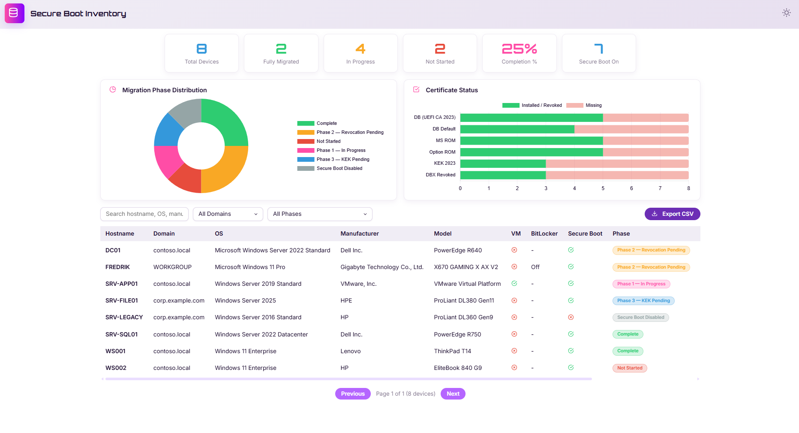
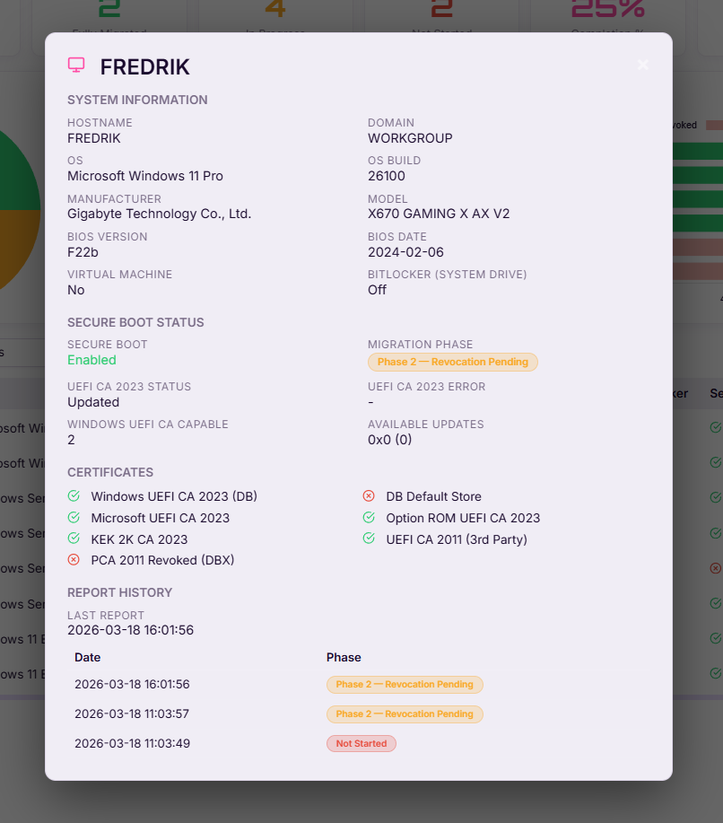

# Secure Boot Certificate Inventory

Inventory dashboard for tracking Microsoft Secure Boot UEFI CA 2023 certificate migration status across your environment.

Tracks the multi-phase migration process related to **CVE-2023-24932** (BlackLotus) including:
- Phase 1: UEFI CA 2023 certificate installation
- Phase 2: PCA 2011 revocation (DBX update)
- Phase 3: KEK certificate update
- Completion status

## Architecture

```
┌─────────────────────┐     POST /api/report      ┌──────────────┐
│  Windows Clients    │ ──────────────────────────>│  Node.js     │
│  (Scheduled Task)   │      (JSON + API Key)      │  Express API │
│                     │                            │              │
│  PowerShell script  │                            │  SQLite DB   │
│  (read-only)        │                            │              │
└─────────────────────┘                            └──────┬───────┘
                                                          │
                                                   ┌──────┴───────┐
                                                   │  Web         │
                                                   │  Dashboard   │
                                                   └──────────────┘
```

## Screenshots





## Quick Start

1. **Install dependencies:**
   ```
   npm install
   ```

2. **Configure:**
   ```
   cp settings.example.json settings.json
   ```
   Edit `settings.json` — change the `apiKey` to a strong secret.

3. **Start server:**
   ```
   npm start
   ```
   Dashboard: http://localhost:3001

4. **Deploy PowerShell script** to clients (see below).

## PowerShell Client Script

The script `scripts/Collect-SecureBootInventory.ps1` runs on each Windows client/server to collect Secure Boot status and report it to the API.

**It is read-only** — it makes no changes to the system. It only reads:
- Registry keys under `HKLM:\SYSTEM\CurrentControlSet\Control\SecureBoot`
- UEFI Secure Boot variables (db, dbdefault, dbx, kek)
- Basic system info (hostname, OS, manufacturer, model)

### Manual run
```powershell
.\Collect-SecureBootInventory.ps1 -ApiUrl "https://inventory.example.com/api/report" -ApiKey "your-api-key"
```

### Scheduled Task (GPO)
Create a scheduled task that runs at startup or on a schedule:
```
powershell.exe -ExecutionPolicy Bypass -File "\\server\share\Collect-SecureBootInventory.ps1" -ApiUrl "https://inventory.example.com/api/report" -ApiKey "your-api-key"
```

> **Note:** The script must run as **Administrator** or **SYSTEM** to read UEFI variables.

## API Endpoints

| Method | Endpoint | Auth | Network | Description |
|--------|----------|------|---------|-------------|
| POST | `/api/report` | API Key | **Internet** | Receive inventory report from client |
| GET | `/api/summary` | — | Internal | Dashboard summary statistics |
| GET | `/api/devices` | — | Internal | List devices (paginated, filterable) |
| GET | `/api/devices/:hostname` | — | Internal | Single device detail + history |
| GET | `/api/filters` | — | Internal | Available filter values |
| GET | `/api/export` | — | Internal | Export all devices as CSV |
| GET | `/api/settings` | — | Internal | Public settings (site name, etc.) |

### Query Parameters for `/api/devices`

| Param | Description |
|-------|-------------|
| `search` | Search hostname, OS, manufacturer, model |
| `domain` | Filter by domain |
| `phase` | Filter by migration phase |
| `sort` | Sort column: hostname, domain, migration_phase, os_name, collected_at, manufacturer |
| `order` | Sort order: asc, desc |
| `limit` | Page size (1-500, default 50) |
| `offset` | Pagination offset |

## Migration Phases

| Phase | Description |
|-------|-------------|
| **Complete** | All certificates installed, old revoked, KEK updated |
| **Phase3_KEKPending** | Certs installed + revoked, KEK update pending |
| **Phase2_RevocationPending** | Certs installed, PCA 2011 revocation pending |
| **Phase1_InProgress** | Certificate installation in progress |
| **Phase0_NotStarted** | Migration not yet started |
| **SecureBootDisabled** | Secure Boot is not enabled |

## References

- [KB5025885 - CVE-2023-24932](https://support.microsoft.com/en-us/topic/how-to-manage-the-windows-boot-manager-revocations-for-secure-boot-changes-associated-with-cve-2023-24932-41a975df-beb2-40c1-99a3-b3ff139f832d)
- [Secure Boot Certificate Updates Guidance](https://support.microsoft.com/en-us/topic/secure-boot-certificate-updates-guidance-for-it-professionals-and-organizations-e2b43f9f-b424-42df-bc6a-8476db65ab2f)
- [Reference PowerShell script](https://github.com/matthewschacherbauer/PowerShell/blob/master/Windows/Auto_MSUEFICA2023.ps1)

---

## Deploying on IIS (Windows Server)

This section covers hosting the app on IIS using **iisnode** so the API is accessible over the internet.

### Prerequisites

1. **Windows Server** with IIS enabled
2. **Node.js** installed (LTS recommended) — [Download](https://nodejs.org)
3. **iisnode** installed — [Download](https://github.com/azure/iisnode/releases)
4. **URL Rewrite** IIS module — [Download](https://www.iis.net/downloads/microsoft/url-rewrite)

### Step-by-step Setup

#### 1. Install IIS Features

Open PowerShell as Administrator:
```powershell
Install-WindowsFeature -Name Web-Server, Web-Asp-Net45, Web-Url-Auth -IncludeManagementTools
```

#### 2. Install Node.js 

Download and install from https://nodejs.org. Verify:
```powershell
node --version
npm --version
```

#### 3. Install iisnode

Download the latest release from [iisnode releases](https://github.com/azure/iisnode/releases) and run the MSI.

#### 4. Install URL Rewrite Module

Download from [IIS URL Rewrite](https://www.iis.net/downloads/microsoft/url-rewrite) and install.

#### 5. Deploy the Application

Copy the project files to the IIS site folder, e.g. `C:\inetpub\SecureBootInventory`:

```powershell
# Copy project files
Copy-Item -Path "C:\Dev\Black_Lotus\*" -Destination "C:\inetpub\SecureBootInventory" -Recurse

# Install dependencies in the deployment folder
cd C:\inetpub\SecureBootInventory
npm install --production
```

#### 6. Configure settings.json

```powershell
cd C:\inetpub\SecureBootInventory
Copy-Item settings.example.json settings.json
```

Edit `settings.json` and set a **strong, unique API key** and configure your **trusted networks**:
```json
{
  "siteName": "Secure Boot Inventory",
  "server": { "port": 3001 },
  "footerText": "© 2026 Secure Boot Inventory",
  "apiKey": "your-strong-random-api-key-here",
  "trustedNetworks": [
    "10.0.0.0/8",
    "172.16.0.0/12",
    "192.168.0.0/16",
    "127.0.0.0/8",
    "::1/128"
  ]
}
```

> **trustedNetworks** controls which IPs can access the dashboard and read-only API endpoints.
> Only `POST /api/report` (the data ingestion endpoint) is accessible from the internet.
> The default includes all RFC 1918 private ranges. Add your VPN or office CIDR ranges as needed.

#### 7. Create IIS Website

**Option A — IIS Manager (GUI):**
1. Open **IIS Manager**
2. Right-click **Sites** → **Add Website...**
3. Site name: `SecureBootInventory`
4. Physical path: `C:\inetpub\SecureBootInventory`
5. Binding: HTTPS, port 443, select your SSL certificate
6. Optionally add an HTTP binding on port 80 (the app redirects to HTTPS)

**Option B — PowerShell:**
```powershell
# Create the site (adjust certificate thumbprint)
New-IISSite -Name "SecureBootInventory" `
  -PhysicalPath "C:\inetpub\SecureBootInventory" `
  -BindingInformation "*:443:" `
  -Protocol https `
  -CertificateThumbPrint "YOUR_CERT_THUMBPRINT" `
  -CertStoreLocation "Cert:\LocalMachine\My"

# Optionally add an HTTP binding for redirect
New-IISSiteBinding -Name "SecureBootInventory" `
  -BindingInformation "*:80:" -Protocol http
```

#### 8. Set Folder Permissions

The IIS application pool identity needs read/write access (for the SQLite database):

```powershell
$sitePath = "C:\inetpub\SecureBootInventory"
$appPoolUser = "IIS AppPool\SecureBootInventory"

# Grant the app pool identity read/write access
icacls $sitePath /grant "${appPoolUser}:(OI)(CI)M" /T
```

#### 9. Set NODE_ENV to Production

In IIS Manager → SecureBootInventory site → **Configuration Editor** → `system.webServer/iisnode`:
- Set `node_env` to `production`

Or it's already set in the included `web.config`.

#### 10. SSL Certificate

For internet-facing deployments, use a valid SSL certificate. Free options:
- **win-acme** (Let's Encrypt for IIS): https://www.win-acme.com/
- Import a certificate from your CA

```powershell
# Example: install win-acme and auto-renew
# Download from https://www.win-acme.com/ and run:
wacs.exe --target iis --siteid 1 --installation iis
```

### Firewall Rules

Open port 443 (and optionally 80) in Windows Firewall:

```powershell
New-NetFirewallRule -DisplayName "IIS HTTPS" -Direction Inbound -Protocol TCP -LocalPort 443 -Action Allow
New-NetFirewallRule -DisplayName "IIS HTTP" -Direction Inbound -Protocol TCP -LocalPort 80 -Action Allow
```

### Network Access Control

The application enforces split access by default:

| Access | Endpoint | Who can access |
|--------|----------|----------------|
| **Internet** | `POST /api/report` | Any IP (requires API key) |
| **Internal only** | Dashboard (`/`), all `GET /api/*` | Trusted networks only |

Clients/servers on the internet can report their inventory via `POST /api/report` with the API key, but the dashboard and all read-only API endpoints (summary, devices, export, filters) are restricted to internal IPs defined in `trustedNetworks`.

To add your office or VPN range:
```json
"trustedNetworks": [
  "10.0.0.0/8",
  "172.16.0.0/12",
  "192.168.0.0/16",
  "203.0.113.0/24",
  "127.0.0.0/8",
  "::1/128"
]
```

### Verify Deployment

1. **From internal network** — browse to `https://your-server-name` — you should see the dashboard
2. **From external network** — browsing to `https://your-server-name` should return **403 Forbidden**
3. **From external network** — `POST /api/report` should work with a valid API key:
   ```powershell
   .\.\Collect-SecureBootInventory.ps1 -ApiUrl "https://your-server-name/api/report" -ApiKey "your-api-key"
   ```
4. Test internal API access:
   ```powershell
   Invoke-RestMethod -Uri "https://your-server-name/api/summary"
   ```

### Troubleshooting

| Issue | Fix |
|-------|-----|
| 500 errors | Check `C:\inetpub\SecureBootInventory\iisnode\` log files |
| iisnode not found | Ensure iisnode MSI was installed; run `iisreset` |
| URL Rewrite errors | Ensure URL Rewrite module is installed |
| Permission denied on DB | Grant app pool identity write access to the site folder |
| `node.exe` not found | Verify Node.js is in PATH; update `nodeProcessCommandLine` in web.config |
| Dashboard returns 403 | Your IP is not in `trustedNetworks` in settings.json; add your network CIDR |
| HTTPS not working | Verify SSL certificate binding in IIS; check certificate expiry |

### Security Checklist for Internet Exposure

- [ ] Change `apiKey` in settings.json to a strong random value (32+ characters)
- [ ] Configure `trustedNetworks` — only IPs in these CIDR ranges can access the dashboard
- [ ] Enable HTTPS with a valid SSL certificate
- [ ] Ensure `NODE_ENV=production` is set (enables HTTPS redirect, disables dev errors)
- [ ] Windows Firewall allows only ports 80/443
- [ ] Keep Node.js and npm packages updated
- [ ] Review IIS request filtering (sensitive files are blocked in web.config)
- [ ] Rate limiting is enabled by default (300 req/15min per IP)
- [ ] Only `POST /api/report` is exposed to the internet; dashboard and read-only APIs are internal-only
